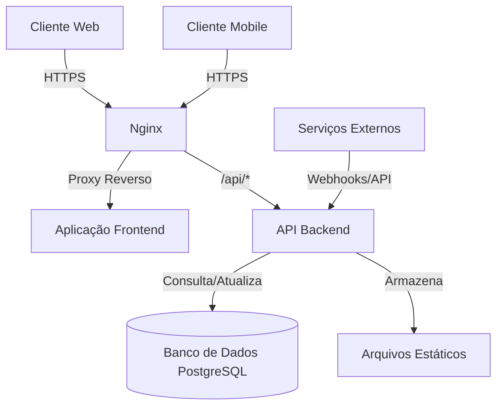

# 🏗️ Visão Geral da Arquitetura

Este documento fornece uma visão geral da arquitetura do sistema Autônomo Control, detalhando seus principais componentes e como eles interagem.

## 🌐 Arquitetura do Sistema

### Diagrama de Arquitetura



## 🖥️ Frontend

### Tecnologias Principais
- **Framework**: React 18 com TypeScript
- **Gerenciamento de Estado**: Context API + useReducer
- **Estilização**: Tailwind CSS
- **Roteamento**: React Router v6
- **Requisições HTTP**: Axios (serviços auth.ts atualizados)
- **Gráficos**: Chart.js
- **Testes**: Jest + React Testing Library (415 testes, 95%+ cobertura)

### Estrutura de Pastas
```
frontend/
├── public/           # Arquivos estáticos
├── src/
│   ├── assets/       # Imagens, ícones, etc.
│   ├── components/   # Componentes reutilizáveis
│   ├── context/      # Contextos React (AuthContext testado)
│   ├── hooks/        # Custom hooks (useAuth testado)
│   ├── pages/        # Páginas da aplicação (Login, Register, ForgotPasswordPage)
│   ├── services/     # Serviços de API (auth.ts com endpoints atualizados)
│   ├── styles/       # Estilos globais
│   ├── types/        # Tipos TypeScript
│   ├── utils/        # Funções utilitárias
│   ├── tests/        # Testes automatizados (415 testes)
│   ├── App.tsx       # Componente raiz
│   └── main.tsx      # Ponto de entrada
```

## 🖥️ Backend

### Tecnologias Principais
- **Framework**: FastAPI (Python 3.8+)
- **Banco de Dados**: PostgreSQL com SQLAlchemy ORM
- **Autenticação**: JWT + Sistema de Conta Master Única
- **Validação de Dados**: Pydantic com campos obrigatórios
- **Segurança**: Sistema de chaves secretas para recuperação
- **Migrações**: Alembic
- **Testes**: Pytest (417 testes, 95%+ cobertura)
- **Documentação**: Swagger UI / ReDoc

### Estrutura de Pastas
```
backend/
├── app/
│   ├── api/v1/        # Rotas da API (auth.py, secret_keys.py)
│   ├── core/          # Configurações centrais (security.py, master_protection.py)
│   ├── db/            # Configuração do banco de dados
│   ├── models/        # Modelos SQLAlchemy
│   ├── schemas/       # Esquemas Pydantic (full_name + name obrigatórios)
│   ├── services/      # Lógica de negócio
│   ├── tests/         # Testes automatizados (417 testes)
│   ├── utils/         # Utilitários
│   └── main.py        # Ponto de entrada
├── migrations/        # Migrações do banco de dados
├── setup_master_account.py  # Setup automático da conta master
└── requirements.txt   # Dependências
```

## 🔄 Fluxo de Dados

1. **Autenticação**
   - Cliente envia credenciais para `/api/v1/auth/token`
   - Servidor valida conta master e retorna token JWT + dados do usuário
   - Token é armazenado no cliente (HTTP-only cookie)
   - Sistema de recuperação via chaves secretas em `/api/v1/secret_keys`

2. **Requisições Autenticadas**
   - Cliente envia token no cabeçalho `Authorization`
   - Middleware valida o token em cada requisição
   - Dados são retornados em formato JSON

3. **Upload de Arquivos**
   - Arquivos são enviados para `/api/upload`
   - Servidor armazena em sistema de arquivos ou serviço S3
   - URL do arquivo é retornada para referência

## 🛡️ Segurança

### Medidas Implementadas
- **Sistema de Conta Master Única**: Proteção contra duplicação de contas administrativas
- **Chaves Secretas**: Sistema de recuperação com hash de 16 caracteres
- **Autenticação JWT**: Tokens com tempo de expiração e dados do usuário
- **Criptografia**: Senhas armazenadas com hash bcrypt
- **CORS Configurado**: Domínios específicos e logging personalizado
- **Headers de Segurança**: Proteção contra XSS, CSRF e timing attacks
- **Validação Robusta**: Pydantic com campos obrigatórios (full_name + name)
- **Testes de Segurança**: 832 testes incluindo proteção contra vulnerabilidades

### Recomendações de Segurança
1. Sempre usar HTTPS em produção
2. Manter dependências atualizadas
3. Monitorar logs de acesso
4. Implementar WAF (Web Application Firewall)
5. Realizar auditorias de segurança periódicas

## 📈 Escalabilidade

### Estratégias
- **Horizontal**: Balanceamento de carga com múltiplas instâncias
- **Vertical**: Aumento de recursos da máquina
- **Cache**: Implementação de Redis para dados frequentemente acessados
- **Filas**: Uso de Celery para tarefas assíncronas

### Monitoramento
- Métricas de desempenho
- Logs centralizados
- Alertas para falhas
- Rastreamento de requisições

## 🔄 CI/CD

### Pipeline de Implantação
1. **Integração Contínua**
   - Testes automatizados
   - Análise estática de código
   - Geração de artefatos

2. **Entrega Contínua**
   - Implantação em ambiente de teste
   - Testes de aceitação
   - Aprovação manual para produção

3. **Implantação**
   - Rollout progressivo
   - Health checks
   - Rollback automático em caso de falha

## 🔄 Fluxo de Desenvolvimento

1. Criar branch a partir de `main`
2. Desenvolver feature/fix
3. Escrever testes
4. Submeter Pull Request
5. Revisão de código
6. Merge após aprovação
7. Deploy automatizado

## 📚 Próximos Passos

- [Documentação da API](./backend/api.md)
- [Guia do Desenvolvedor Frontend](./frontend/estrutura.md)
- [Guia do Desenvolvedor Backend](./backend/estrutura.md)
- [Políticas de Segurança](../03_guia_desenvolvedor/seguranca.md)
